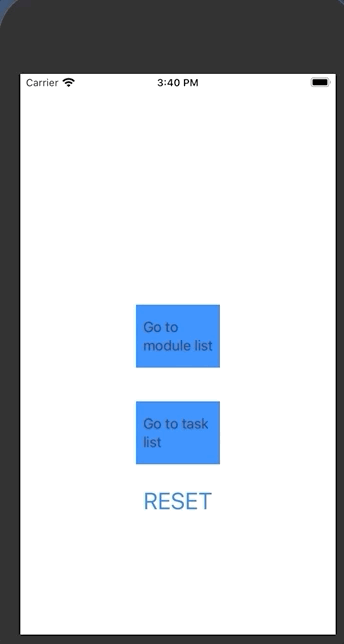
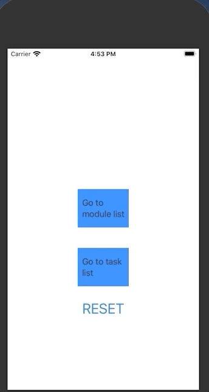

## Milestone #2

### 1. Project Status Until The End of June

**1. User Interface**
-  Basic navigation design
-  Draft about each page

**2. Functionality**
- Add tasks to the global task list
- Add modules to the module list
- Add tasks under each module
- Link each task to the corresponding study view
- Setting the timer in the study view
- Go to the current working assignment from the main page

Note: The global task list contains all the tasks recorded in the system, and each module has a task list for itself.
You can add some tasks when you create the module(default assignment)

**3. Summary**

We have implemented some basic functions for this application. But we haven't considered the quality of UI, we only use the default List and NavigationView in SwiftUI. We need to work on the UI design and then implement them with SwiftUI. 

### 2. Things Need To Be Done in July
**1. User Interface**
- Consider the Human Interface Documentation from Apple
- Design the Interface using Adobe XD
- Implement a better design using SwiftUI
- Add a view for statistic data (Consider the representation of the data,eg.pie chart...)

**2. Functionality**
- Implement the extend feature of a task (You can extend the study time after the timer stops but the task has not done yet)
- Implement the statistic collection mechanism
- Testing and find out the bugs
- Implement the Notification mechanism
- Implement the ordering of the task
- Detect the backward
- Muti-select and delete
- Implement the completion of tasks (Using toggle)

**3. Code**
- Change the code to a neater way (Consider the OOP principle, but sometimes it's quite hard for view representation)

### 3. Problem Encountered

**1. Core Data**
- We spent quite a lot of time to figure out how to use the core data in Swift. We need to know how to fetch the result and how to use it. Turns out it quite simple, because it is like the normal class.
- I tried to let each Module has a property assignmentList. It is a reasonable design, but it has some problem when I implement the functionality. So I just delete this property. We get the task list of a module by going through all tasks, and display those with the same module name. But it is not a good design as mentioned above, this is something we need to change.

**2. Functionality**
- Display of the list: We use the built-in ListView to represent both module list and task list
- Creation of task under a new module and "raw" new task: We tried to use the same struct NewTaskView to represent both of them since the only difference is the creation of a task under a new module needs a fixed module name. We tried to do this by adding a Module?（Optional Module）. So when there is a module, we can fix the module name, otherwise, just have a normal procedure to create a module. But it seems not to work for me. So I just hard code another struct for creation of task
under a new module (or module). But I believe there is a better way, so this should be fixed in July.
- Passing the parameter between the view: At first, we are confused about how to pass a parameter between the view since we need to consider the abstraction. Our solution
is using @Binding in the sub-view. So that when the parameter change, it will trigger the change all the way to the root view.
- Delete module and all associate tasks: At first we can only delete the module, but the task associate with it still in the core data. So we write a new deletion function to achieve to delete all the task associate with this module instead of only deleting the module name in core data
- Cannot use picker for the time setter in the NewTaskView, we need to figure it out in the following month to give a better user experience.

**3. User Interface**
- Display of the UI with more than one functionality: As we follow the OOP principle when creating different views, such as ClockView, TimerView, StudyView, etc... All of them work perfectly fine on their own, but when combining them in one view (eg: adding both ClockView and TimerView in StudyView), the preview won't be able to show the combined view, for now, we will have to work on it in the following month.
- As we transforming the view from purely static to functional, we will have to combine it with the model of our app, as we will need some real examples to run our app, I'm still learning the part of core data, which I'm going to catch up on the following week.
- Nested navigation view does not have a good look, we need to find a way to resolve this.

### Demo

1.Add new task

2.Add new module with tasks

                                                                          

3.Ordering of tasks

4.Delete module and associate task

5.Study view with countdown timer

